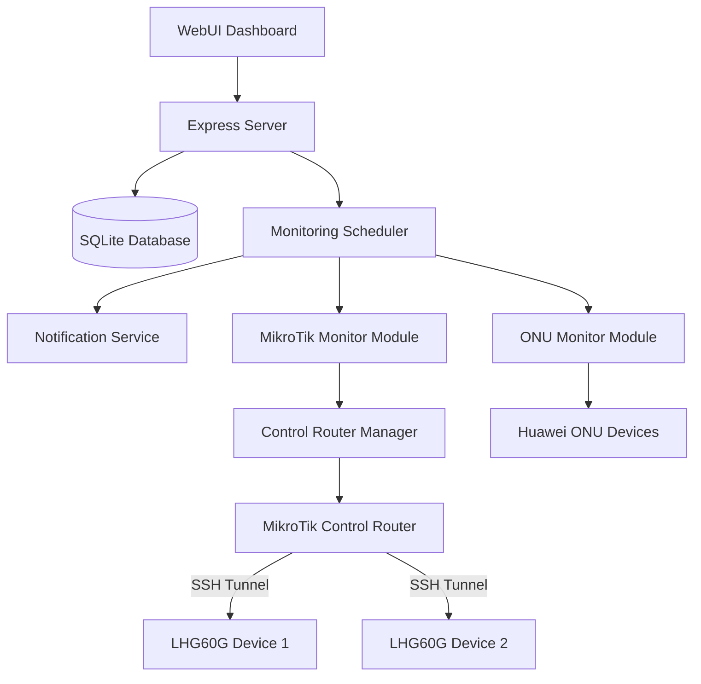
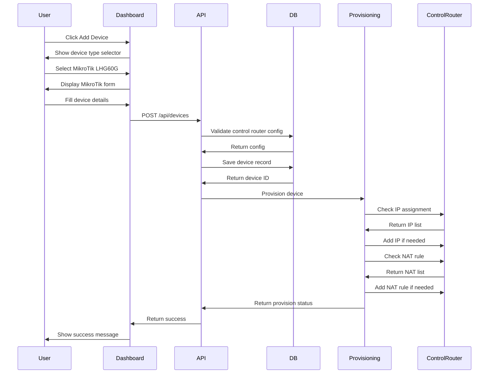
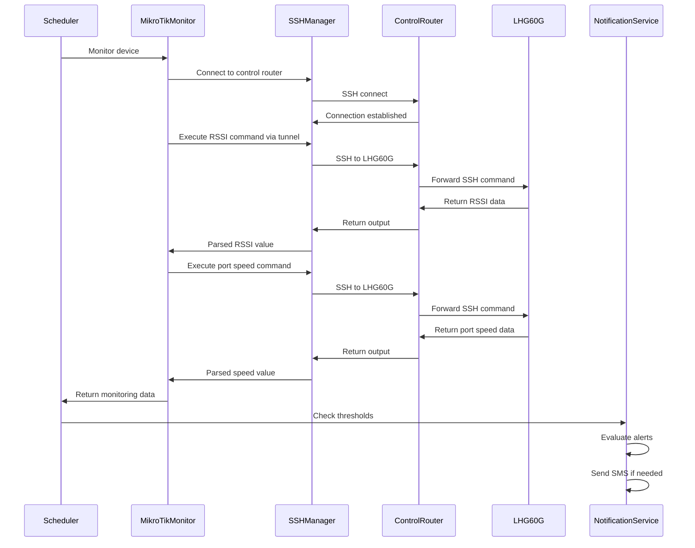

# Design Document: MikroTik LHG60G Device Support

## Overview

Extend the ONU Power Monitor system to support MikroTik LHG60G wireless devices in addition to existing Huawei ONU devices. The system will monitor RSSI signal strength and Ethernet port speeds for LHG60G devices through a centralized MikroTik control router.

## Business Requirements

### Primary Objectives
- Monitor MikroTik LHG60G wireless devices alongside existing Huawei ONU devices
- Track RSSI signal strength and Ethernet port speeds for LHG60G devices
- Configure threshold-based alerting for RSSI and port speed degradation
- Manage LHG60G device connectivity through a central MikroTik control router

### Success Criteria
- Users can add and configure MikroTik LHG60G devices via dashboard
- System automatically monitors RSSI and Ethernet speeds at configured intervals
- Notifications trigger when RSSI or port speed fall below thresholds
- Control router automatically configures network routing and NAT rules for new devices

## System Architecture

### Architecture Principles
- Dual device support: Maintain existing Huawei ONU monitoring while adding MikroTik support
- Separation of concerns: Distinct monitoring modules per device type
- Central control: Single MikroTik router manages access to all LHG60G devices
- Automated provisioning: System handles network configuration automatically

### High-Level Component Structure



## Functional Design

### Device Type Architecture

#### Device Type Enumeration
The system will support two primary device types:
- Huawei ONU: blue, red
- MikroTik: mikrotik_lhg60g

Each device type determines monitoring behavior, configuration options, and data extraction methods.

### Global Configuration: Control Router Settings

#### Purpose
Centralized configuration for the MikroTik control router that manages LHG60G device access.

#### Configuration Parameters

| Parameter | Description | Example | Validation |
|-----------|-------------|---------|------------|
| Control Router IP | IP address of the control MikroTik router | 172.26.26.40 | Valid IPv4 address |
| Control Router Username | SSH username for control router | admin | Non-empty string |
| Control Router Password | SSH password for control router | [encrypted] | Non-empty string |
| WireGuard Interface Name | Name of WireGuard interface on control router | wireguard1 | Non-empty string |
| LHG60G Ethernet Interface | Ethernet interface connected to LHG60G network | ether2-Dish | Non-empty string |
| Base Port Number | Starting port for NAT port forwarding | 60001 | 1024-65535 |

#### Storage Strategy
Store in dedicated database table for global system configuration. Encrypt sensitive credentials using existing encryption mechanism.

#### User Interface Access
Settings accessible via dashboard top navigation through dedicated settings button. Modal dialog for configuration with validation.

#### Device Management: LHG60G Devices

#### Add Device Workflow

**User Interface Flow**:
1. User clicks Add Device button on dashboard
2. Device Type Selector displays: Huawei ONU or MikroTik LHG60G
3. When MikroTik selected, form displays MikroTik-specific fields
4. User provides device information and monitoring preferences
5. System validates and saves device
6. Background process provisions control router configuration

**Device Information Required**:

| Field | Description | Example | Required |
|-------|-------------|---------|----------|
| Device Name | User-friendly identifier | Building A - Roof | Yes |
| Device Group | Organizational grouping | Campus North | No |
| LHG60G IP Address | Local IP of the LHG60G device | 10.117.114.238 | Yes |
| SSH Port | Custom SSH port for NAT mapping | 60001 | Yes |
| SSH Username | LHG60G device SSH username | admin | Yes |
| SSH Password | LHG60G device SSH password | [encrypted] | Yes |
| Control Router Tunnel IP | IP address for NAT tunnel endpoint | 172.31.207.40 | Yes |

#### Monitoring Configuration

**RSSI Monitoring**:
| Setting | Description | Default | Editable |
|---------|-------------|---------|----------|
| Enable RSSI Monitoring | Track wireless signal strength | Enabled | Yes |
| RSSI Threshold | Alert when signal drops below this value | -66 dBm | Yes |
| Display on Dashboard | Show RSSI value in device status | Enabled | Yes |

**Ethernet Port Speed Monitoring**:
| Setting | Description | Default | Editable |
|---------|-------------|---------|----------|
| Enable Port Speed Monitoring | Track Ethernet interface speed | Enabled | Yes |
| Speed Threshold | Alert when speed falls below threshold | 1000 Mbps | Yes |
| Threshold Options | User-selectable speed levels | 10 Mbps, 100 Mbps, 1000 Mbps | Yes |
| Display on Dashboard | Show port speed in device status | Enabled | Yes |

#### Notification Settings

| Alert Type | Trigger Condition | Message Format |
|------------|-------------------|----------------|
| Low RSSI | Current RSSI less than threshold | "Low RSSI Alert: {GroupName} - {DeviceName} - Current: {Value} dBm, Threshold: {Threshold} dBm" |
| Degraded Port Speed | Current speed less than threshold | "Port Speed Alert: {GroupName} - {DeviceName} - Current: {Speed} Mbps, Threshold: {Threshold} Mbps" |
| Device Offline | Device unreachable after retry attempts | "Device Offline: {GroupName} - {DeviceName} at {IP} is not responding" |

#### Delete Device Workflow

**User Interface Flow**:
1. User selects MikroTik device and clicks Delete button
2. System displays confirmation dialog
3. User confirms deletion
4. System performs cleanup operations
5. System removes device from database
6. Dashboard updates to remove device from list

**Cleanup Operations for MikroTik Devices**:

**Operation 1: Remove NAT Rule**
- Query existing NAT rules on control router
- Identify NAT rule associated with device by matching:
  - Comment field containing device name
  - Destination port matching device SSH port
  - To-address matching device LHG60G IP
- Remove matched NAT rule from firewall

**Operation 2: Check Tunnel IP Usage**
- Query all remaining MikroTik devices in database
- Extract tunnel IP subnet from deleted device (e.g., 10.117.114.40/24)
- Check if any other device uses an IP in the same subnet
- Comparison logic: Match network portion of IP addresses
  - Example: Device 1 IP 10.117.114.237 matches subnet 10.117.114.0/24
  - Example: Device 2 IP 10.117.114.238 matches subnet 10.117.114.0/24

**Operation 3: Remove IP Address from Interface** (conditional)
- Condition: No other MikroTik devices use the same subnet
- Command: `/ip address remove [find where address="{tunnel_ip}/24" and interface="{lhg60g_interface}"]`
- Example: `/ip address remove [find where address="10.117.114.40/24" and interface="ether2-Dish"]`
- Result: IP address removed from control router interface

**Operation 4: Preserve IP Address** (conditional)
- Condition: Other MikroTik devices still use the same subnet
- Action: Skip IP address removal
- Reason: Shared subnet required for other devices
- Logging: Record that IP preserved due to active usage

**Error Handling During Deletion**:

| Error Scenario | Detection | Resolution |
|----------------|-----------|------------|
| NAT rule not found | Query returns empty result | Log warning, continue with deletion |
| NAT rule removal fails | Command execution error | Log error, continue with database deletion |
| IP address not found | Query returns empty result | Log warning, continue with deletion |
| IP address removal fails | Command execution error | Log error, preserve IP address |
| Control router unreachable | SSH connection timeout | Delete from database, log cleanup failure |

**Cleanup Workflow Decision Tree**:
```
Delete Device Request
  ↓
Remove from Database
  ↓
Connect to Control Router
  ↓
  ├─ Success → Remove NAT Rule
  │              ↓
  │            Check Remaining Devices
  │              ↓
  │              ├─ Subnet Still Used → Keep IP Address
  │              └─ Subnet Not Used → Remove IP Address
  │
  └─ Failure → Log Error, Complete Deletion
```

### Control Router Provisioning

#### Automatic Configuration Process

When a new LHG60G device is added, the system performs automated provisioning:

**Step 1: Validate Control Router Configuration**
- Verify global control router settings exist
- Test SSH connectivity to control router
- Confirm required interfaces exist

**Step 2: Check IP Address Assignment**
- Execute filtered command to list IP addresses on specific LHG60G ethernet interface
- Command filters by interface name provided in global settings
- Parse output to identify if tunnel IP exists on the interface
- Determine if new address assignment required

**Command Pattern**: `/ip address print where interface={LHG60G_ethernet_interface}`

**Example Command**: `/ip address print where interface=ether2-Dish`

**Example Output Inspection**:
```
Columns: ADDRESS, NETWORK, INTERFACE

# ADDRESS           NETWORK       INTERFACE  
0 192.168.40.10/24  192.168.40.0  ether2-Dish
1 10.117.114.40/24  10.117.114.0  ether2-Dish
```

**Decision Logic**:
- Extract all ADDRESS values from filtered output
- Check if tunnel IP (without subnet mask) matches any ADDRESS prefix
- Example: If tunnel IP is 10.117.114.40, check against 192.168.40.10/24 and 10.117.114.40/24
- If LHG60G IP address found on target interface: Skip IP assignment
- If LHG60G IP address not found: Add new IP address assignment

**Step 3: Add IP Address Assignment** (if needed)
- Construct IP address with appropriate subnet mask
- Use tunnel IP provided during device creation
- Assign to LHG60G ethernet interface specified in global settings

**Command Parameters**:
- Address: User-provided tunnel IP with /24 subnet mask
- Interface: LHG60G ethernet interface from global settings

**Step 4: Check NAT Rule Existence**
- Query existing NAT rules on control router
- Check for duplicate rules based on:
  - Destination port matching
  - Target address matching
  - Comment matching device name

**Step 5: Add NAT Rule** (if not exists)
- Create destination NAT rule for SSH port forwarding
- Map external port to internal LHG60G device SSH port
- Include device name in comment for identification

**NAT Rule Parameters**:

| Parameter | Value Source | Example |
|-----------|--------------|---------|
| Action | Fixed: dst-nat | dst-nat |
| Chain | Fixed: dstnat | dstnat |
| Comment | Device name from form | "Building A - Roof" |
| Destination Address | Control router IP from global settings | 172.26.26.40 |
| Destination Port | SSH port from device form | 60001 |
| Protocol | Fixed: TCP | tcp |
| To Addresses | LHG60G IP address from device form | 10.117.114.238 |
| To Ports | Fixed: SSH default | 22 |

**Step 6: Verify Provisioning**
- Test SSH connectivity through NAT tunnel
- Confirm device responds to monitoring commands
- Update device status in database

#### Error Handling Strategy

| Error Scenario | Detection | Resolution |
|----------------|-----------|------------|
| Control router unreachable | SSH connection timeout | Display error to user, prevent device creation |
| Interface not found | Command output parsing failure | Display error, request valid interface name |
| Port already in use | Duplicate NAT rule detected | Suggest different port or display conflict |
| Authentication failure | SSH authentication error | Prompt user to verify control router credentials |
| IP assignment failure | Command execution error | Display error, allow manual intervention |

### Data Extraction: MikroTik LHG60G

#### RSSI Signal Strength

**Monitoring Approach**:
- Connect to LHG60G device via SSH through control router NAT tunnel
- Execute wireless interface monitor command
- Parse RSSI value from command output

**SSH Connection Path**:
```
WebUI Server → Control Router → NAT Forwarding → LHG60G Device
```

**Command Execution**:
- Interface: W60G wireless interface
- Monitor command: Returns current wireless statistics
- Output filtering: Extract RSSI field value

**Example Output Pattern**:
```
rssi: -56
```

**Data Extraction Logic**:
- Locate RSSI field in command output
- Extract numeric value with sign
- Convert to integer dBm value
- Validate range: typical values -90 to -30 dBm

**Data Structure**:
```
{
  rssi: -56,
  rssiUnit: "dBm",
  timestamp: "2025-12-15T15:30:00Z"
}
```

#### Ethernet Port Speed

**Monitoring Approach**:
- Connect to LHG60G device via SSH through control router NAT tunnel
- Execute ethernet interface monitor command
- Parse speed value from command output

**Command Execution**:
- Interface: Ethernet interface on LHG60G
- Monitor command: Returns current ethernet statistics
- Output filtering: Extract rate field value

**Example Output Pattern**:
```
rate: 1Gbps
```

**Data Extraction Logic**:
- Locate rate field in command output
- Extract speed value and unit
- Normalize to Mbps for consistency:
  - 10Mbps → 10
  - 100Mbps → 100
  - 1Gbps → 1000
  - 10Gbps → 10000

**Data Structure**:
```
{
  portSpeed: 1000,
  portSpeedUnit: "Mbps",
  portSpeedRaw: "1Gbps",
  timestamp: "2025-12-15T15:30:00Z"
}
```

### Monitoring Scheduler Integration

#### Scheduler Behavior
The existing monitoring scheduler will be extended to handle MikroTik devices alongside Huawei ONU devices.

**Device Type Detection**:
- Query device type from database
- Route to appropriate monitoring module:
  - Huawei ONU → onuMonitor module
  - MikroTik LHG60G → mikrotikMonitor module

**Monitoring Interval**:
- Configurable per device (default: 900 seconds / 15 minutes)
- Same interval configuration as Huawei ONU devices
- Independent scheduling per device

**Retry Logic**:
- Same retry mechanism as existing devices
- Configurable retry attempts (default: 3)
- Configurable retry delay (default: 3 seconds)

**Workflow for MikroTik Devices**:
1. Scheduler triggers monitoring for device
2. Retrieve device configuration from database
3. Retrieve global control router configuration
4. Establish SSH connection to control router
5. Execute tunneled SSH command to LHG60G device
6. Parse monitoring data (RSSI and port speed)
7. Update monitoring cache with results
8. Evaluate notification thresholds
9. Send alerts if thresholds exceeded
10. Update device status and last check timestamp

### Notification Integration

#### Alert Evaluation

**RSSI Threshold Check**:
- Condition: Current RSSI value less than configured threshold
- Default threshold: -66 dBm
- User configurable threshold range: -90 to -30 dBm

**Port Speed Threshold Check**:
- Condition: Current port speed strictly less than configured threshold
- Default threshold: 1000 Mbps (1 Gbps)
- Threshold options: 10 Mbps, 100 Mbps, 1000 Mbps
- Comparison: Use strict less-than operator (not less-than-or-equal)

**Device Offline Check**:
- Condition: SSH connection fails after all retry attempts
- Notification: Send only once until device recovers
- Recovery notification: Send when device comes back online

#### Notification Message Format

Follow existing notification format pattern with group name and device name:

**Format**: `{AlertType}: {GroupName} - {DeviceName} - {Details}`

**Examples**:
- "Low RSSI Alert: Campus North - Building A - Roof - Current: -70 dBm, Threshold: -66 dBm"
- "Port Speed Alert: Campus North - Building A - Roof - Current: 100 Mbps, Threshold: 1000 Mbps"
- "Device Offline: Campus North - Building A - Roof at 10.117.114.238 is not responding"

### Database Schema Extensions

#### Control Router Configuration Table

**Table Name**: mikrotik_control_config

| Column | Type | Constraints | Description |
|--------|------|-------------|-------------|
| id | INTEGER | PRIMARY KEY | Configuration record ID |
| control_ip | TEXT | NOT NULL | Control router IP address |
| control_username | TEXT | NOT NULL | SSH username |
| control_password_encrypted | TEXT | NOT NULL | Encrypted SSH password |
| wireguard_interface | TEXT | NOT NULL | WireGuard interface name |
| lhg60g_ethernet_interface | TEXT | NOT NULL | LHG60G ethernet interface |
| base_port | INTEGER | DEFAULT 60001 | Starting port for NAT |
| created_at | DATETIME | DEFAULT CURRENT_TIMESTAMP | Creation timestamp |
| updated_at | DATETIME | DEFAULT CURRENT_TIMESTAMP | Last update timestamp |

**Note**: Single row configuration table (id=1 always)

#### Device Table Extensions

**Table**: onu_devices (rename to devices for clarity)

**New Columns**:

| Column | Type | Constraints | Description |
|--------|------|-------------|-------------|
| device_type | TEXT | NOT NULL CHECK(device_type IN ('onu_blue', 'onu_red', 'mikrotik_lhg60g')) | Device type identifier |
| mikrotik_lhg60g_ip | TEXT | NULL | LHG60G device IP address |
| mikrotik_ssh_port | INTEGER | NULL | SSH port for NAT tunnel |
| mikrotik_tunnel_ip | TEXT | NULL | Tunnel IP on control router |
| notify_rssi | INTEGER | DEFAULT 0 | Enable RSSI notifications |
| rssi_threshold | REAL | DEFAULT -66.0 | RSSI alert threshold |
| notify_port_speed | INTEGER | DEFAULT 0 | Enable port speed notifications |
| port_speed_threshold | INTEGER | DEFAULT 1000 | Port speed threshold in Mbps |
| show_rssi | INTEGER | DEFAULT 1 | Display RSSI on dashboard |
| show_port_speed | INTEGER | DEFAULT 1 | Display port speed on dashboard |

**Migration Strategy**:
- Existing onu_type values map to device_type:
  - 'blue' → 'onu_blue'
  - 'red' → 'onu_red'
- New MikroTik columns nullable for backward compatibility
- Add columns via ALTER TABLE migration script

#### Monitoring Cache Extensions

**Table**: monitoring_cache

**Data Structure Changes**:
- Existing JSON data field supports flexible schema
- MikroTik devices store different data structure
- No schema changes required

**MikroTik Cache Data Format**:
```
{
  "rssi": -56,
  "rssiUnit": "dBm",
  "portSpeed": 1000,
  "portSpeedUnit": "Mbps",
  "portSpeedRaw": "1Gbps",
  "timestamp": "2025-12-15T15:30:00Z"
}
```

**Huawei ONU Cache Data Format** (unchanged):
```
{
  "currentValue": "-12.5 dBm",
  "referenceValue": "-27 to -8 dBm",
  "txPower": "2.3 dBm",
  "temperature": "45 ℃",
  "temperatureRange": "-10 to +85 ℃",
  "voltage": "3300 mV",
  "uiType": "red",
  "portSpeeds": {
    "eth1-speed": 1000,
    "eth2-speed": 0
  }
}
```

### User Interface Design

#### Dashboard Device List

**Device Type Indicator**:
- Visual icon or badge indicating device type
- Color coding: Huawei ONU (blue/red), MikroTik (orange)

**MikroTik Device Display Columns**:

| Column | Display Value | Condition |
|--------|---------------|-----------|
| Device Name | User-provided name with group prefix | Always |
| Type | "MikroTik LHG60G" | Always |
| RSSI | "{value} dBm" with color indicator | If show_rssi enabled |
| Port Speed | "{value} Mbps" or "{value} Gbps" | If show_port_speed enabled |
| Status | Online / Offline / Error | Always |
| Last Checked | Relative time (e.g., "2 minutes ago") | Always |

**Status Color Coding**:
- Online, RSSI ≥ threshold: Green
- Online, RSSI below threshold: Yellow
- Online, port speed below threshold: Yellow
- Online, multiple alerts: Red
- Offline: Gray

#### Add/Edit Device Modal

**Device Type Selection**:
- Dropdown or radio button group
- Options: "Huawei ONU", "MikroTik LHG60G"
- Dynamic form fields based on selection

**MikroTik Form Sections**:

**Section 1: Basic Information**
- Device Name (text input, required)
- Device Group (dropdown, optional)

**Section 2: Connection Details**
- LHG60G IP Address (text input, required, IPv4 validation)
- SSH Port (number input, required, range: 1024-65535)
- SSH Username (text input, required)
- SSH Password (password input, required)
- Control Router Tunnel IP (text input, required, IPv4 validation)

**Section 3: Monitoring Options**
- Show RSSI on Dashboard (checkbox, default: checked)
- Show Port Speed on Dashboard (checkbox, default: checked)

**Section 4: Notification Settings**
- Enable RSSI Notifications (checkbox, default: unchecked)
  - RSSI Threshold (number input, default: -66, range: -90 to -30)
- Enable Port Speed Notifications (checkbox, default: unchecked)
  - Speed Threshold (dropdown: 10 Mbps, 100 Mbps, 1000 Mbps, default: 1000)
- Enable Offline Notifications (checkbox, default: unchecked)

**Section 5: Advanced Settings**
- Monitoring Interval (number input, default: 900 seconds)
- Retry Attempts (number input, default: 3)
- Retry Delay (number input, default: 3 seconds)

**Form Validation**:
- All required fields must be filled
- IP addresses must be valid IPv4 format
- Port must be in valid range and not conflict with existing devices
- Thresholds must be within specified ranges

#### Settings Modal: Control Router

**Access**: Top navigation settings button

**Form Fields**:
- Control Router IP Address (text input, required, IPv4 validation)
- Username (text input, required)
- Password (password input, required)
- WireGuard Interface Name (text input, required)
- LHG60G Ethernet Interface (text input, required, suggest: ether2-Dish)
- Base Port Number (number input, default: 60001, range: 1024-65535)

**Actions**:
- Test Connection button: Verify SSH connectivity before saving
- Save button: Validate and save configuration
- Cancel button: Close without saving

**Validation**:
- Test SSH connection to control router
- Verify WireGuard interface exists
- Verify ethernet interface exists
- Ensure base port not in use

## Technical Design

### SSH Communication Module

#### Purpose
Provide reliable SSH connectivity to MikroTik devices without depending on system-level SSH clients.

#### Technology Selection
Use Node.js ssh2 library for programmatic SSH connections.

**Rationale**:
- Pure JavaScript implementation
- No external binary dependencies
- Cross-platform compatibility
- Async/await support
- Stream-based command execution

#### SSH Connection Manager

**Responsibility**: Manage SSH connections to control router and tunneled connections to LHG60G devices.

**Key Operations**:

**Operation 1: Connect to Control Router**
- Input: Control router credentials from global configuration
- Process: Establish SSH connection with authentication
- Output: Active SSH client instance
- Error Handling: Connection timeout, authentication failure, network errors

**Operation 2: Execute Command on Control Router**
- Input: SSH client, command string
- Process: Execute command via SSH exec channel
- Output: Command stdout, stderr, exit code
- Error Handling: Command execution timeout, permission errors

**Operation 3: Execute Command on LHG60G via Tunnel**
- Input: Control router credentials, LHG60G IP, port, command
- Process: SSH to control router, then nested SSH to LHG60G
- Output: Command output from LHG60G device
- Error Handling: Tunnel failure, nested authentication failure

**Connection Lifecycle**:
1. Establish connection before command execution
2. Execute command with timeout protection
3. Close connection after operation completes
4. Reuse connection for multiple commands when efficient

**Timeout Strategy**:
- Connection establishment: 10 seconds
- Command execution: 30 seconds
- Overall operation: 45 seconds

#### Command Output Parser

**Responsibility**: Extract structured data from MikroTik command output.

**RSSI Parser**:
- Input: Raw output from wireless monitor command
- Pattern: Line containing "rssi:" followed by whitespace and numeric value
- Extraction: Regular expression match for signed integer
- Output: Integer RSSI value in dBm
- Error Handling: Missing field, invalid format, out-of-range value

**Port Speed Parser**:
- Input: Raw output from ethernet monitor command
- Pattern: Line containing "rate:" followed by whitespace and speed string
- Extraction: Regex match for numeric value and unit (Mbps, Gbps)
- Normalization: Convert all values to Mbps integer
- Output: Integer speed in Mbps
- Error Handling: Missing field, unknown unit, invalid format

**Parser Error Recovery**:
- Return null for unparseable values
- Log parsing failures with raw output for debugging
- Allow partial success (e.g., RSSI extracted but port speed failed)

### MikroTik Monitor Module

**Module Name**: mikrotikMonitor.js

**Module Responsibilities**:
- Execute monitoring operations for MikroTik LHG60G devices
- Coordinate with SSH connection manager
- Parse and structure monitoring data
- Handle errors and retries

**Key Functions**:

**Function: monitorMikroTik**
- Purpose: Main entry point for monitoring a MikroTik device
- Input: Device configuration object
- Process:
  1. Retrieve global control router configuration
  2. Establish SSH connection to control router
  3. Build tunneled SSH command for LHG60G device
  4. Execute RSSI monitoring command
  5. Execute port speed monitoring command
  6. Parse and structure results
  7. Return monitoring data
- Output: Monitoring result object
- Error Handling: Connection failures, command failures, parsing errors

**Function: getRSSI**
- Purpose: Query and extract RSSI value
- Input: SSH connection, device IP, port, credentials
- Process: Execute W60G monitor command, parse output
- Output: RSSI value in dBm
- Error Handling: Command failure, parsing failure

**Function: getPortSpeed**
- Purpose: Query and extract Ethernet port speed
- Input: SSH connection, device IP, port, credentials
- Process: Execute ethernet monitor command, parse output
- Output: Port speed in Mbps
- Error Handling: Command failure, parsing failure

**Function: checkConnectivity**
- Purpose: Verify device reachability
- Input: Device configuration
- Process: Attempt SSH connection through tunnel
- Output: Boolean reachability status
- Error Handling: Timeout treated as unreachable

**Data Flow**:
```
Device Config → Get Control Router Config → SSH Connect → Execute Commands → Parse Output → Structure Data → Return Result
```

**Result Object Structure**:
```
{
  success: true/false,
  data: {
    rssi: -56,
    rssiUnit: "dBm",
    portSpeed: 1000,
    portSpeedUnit: "Mbps",
    portSpeedRaw: "1Gbps",
    timestamp: "ISO 8601 timestamp"
  },
  error: "error message if failed"
}
```

### Control Router Provisioning Module

**Module Name**: mikrotikProvisioning.js

**Module Responsibilities**:
- Automate control router configuration for new LHG60G devices
- Manage IP address assignments
- Create and verify NAT rules
- Ensure idempotent operations

**Key Functions**:

**Function: provisionDevice**
- Purpose: Orchestrate complete provisioning workflow
- Input: Device configuration object
- Process:
  1. Validate control router configuration
  2. Test control router connectivity
  3. Check and add IP address if needed
  4. Check and add NAT rule if needed
  5. Verify device accessibility
  6. Return provisioning status
- Output: Success status and any warnings
- Error Handling: Rollback on failure when possible

**Function: checkIPAssignment**
- Purpose: Verify if tunnel IP exists on interface
- Input: SSH connection, tunnel IP, interface name
- Process: Execute filtered IP address print command with interface filter, parse output
- Command: `/ip address print where interface={interface_name}`
- Output Parsing: Extract ADDRESS column values, compare with tunnel IP
- Output: Boolean indicating if IP exists
- Error Handling: Command parsing errors, empty results

**Function: addIPAddress**
- Purpose: Add IP address to interface
- Input: SSH connection, tunnel IP, interface name
- Process: Execute IP address add command
- Output: Success status
- Error Handling: Command execution errors, duplicate address

**Function: checkNATRule**
- Purpose: Verify if NAT rule exists for device
- Input: SSH connection, device config
- Process: Execute firewall NAT print command, search for matching rule
- Output: Boolean indicating if rule exists
- Error Handling: Command parsing errors

**Function: addNATRule**
- Purpose: Create NAT rule for device
- Input: SSH connection, device config, control router IP
- Process: Execute firewall NAT add command with parameters
- Output: Success status
- Error Handling: Command execution errors, rule conflicts

**Function: verifyDeviceAccess**
- Purpose: Test SSH connectivity to LHG60G through tunnel
- Input: Device configuration
- Process: Attempt SSH connection via NAT tunnel
- Output: Boolean connectivity status
- Error Handling: Connection failures

**Function: deprovisionDevice**
- Purpose: Remove control router configuration for deleted device
- Input: Device configuration, all remaining devices
- Process:
  1. Remove NAT rule associated with device
  2. Query remaining devices for subnet usage
  3. Remove IP address if subnet unused
  4. Return cleanup status
- Output: Cleanup success status and operations performed
- Error Handling: Log errors but complete database deletion

**Function: removeNATRule**
- Purpose: Remove NAT firewall rule for device
- Input: SSH connection, device SSH port, device name, LHG60G IP
- Process: Find and remove NAT rule matching device parameters
- Command: `/ip firewall nat remove [find where dst-port={port} and to-addresses={lhg60g_ip}]`
- Output: Success status
- Error Handling: Rule not found (warning), command failure (error)

**Function: checkSubnetUsage**
- Purpose: Determine if tunnel IP subnet is used by other devices
- Input: Tunnel IP address, list of remaining devices
- Process:
  1. Extract subnet from tunnel IP (e.g., 10.117.114.40/24 → 10.117.114.0/24)
  2. Iterate through remaining MikroTik devices
  3. Check if any device LHG60G IP falls in same subnet
  4. Return usage status
- Output: Boolean indicating if subnet is in use
- Error Handling: Invalid IP format errors

**Function: removeIPAddress**
- Purpose: Remove IP address from control router interface
- Input: SSH connection, tunnel IP with subnet mask, interface name
- Process: Execute IP address remove command with filters
- Command: `/ip address remove [find where address="{tunnel_ip}/24" and interface="{interface}"]`
- Output: Success status
- Error Handling: Address not found (warning), command failure (error)

**Idempotency Strategy**:
- Always check before creating
- Skip operations if already configured
- Log all operations for audit trail
- Return success if already in desired state

**Error Recovery**:
- Provide detailed error messages for troubleshooting
- Suggest corrective actions when possible
- Do not fail silently
- Allow manual intervention when automated provisioning fails

### API Endpoints

#### Global Configuration Endpoints

**GET /api/mikrotik/control-config**
- Purpose: Retrieve control router configuration
- Authentication: Required
- Response: Control router settings (password encrypted)

**POST /api/mikrotik/control-config**
- Purpose: Save control router configuration
- Authentication: Required
- Request Body: Control router settings
- Response: Success status
- Validation: Test SSH connection before saving

**POST /api/mikrotik/control-config/test**
- Purpose: Test control router connectivity
- Authentication: Required
- Request Body: Control router credentials
- Response: Connection test result with interface validation

#### Device Management Endpoints

**POST /api/devices** (enhanced)
- Existing endpoint extended to support MikroTik devices
- Request Body: Includes device_type field
- Device Type Handling:
  - If device_type is mikrotik_lhg60g: Validate MikroTik fields, trigger provisioning
  - If device_type is onu_blue or onu_red: Use existing ONU logic
- Response: Device ID and provisioning status

**PUT /api/devices/:id** (enhanced)
- Existing endpoint extended to support MikroTik devices
- Update Behavior: Allow changing thresholds and display settings
- Restriction: Cannot change device type after creation
- Provisioning: Re-run if connection details change

**POST /api/devices/:id/monitor** (enhanced)
- Existing endpoint extended to support MikroTik devices
- Monitoring Routing:
  - Query device_type from database
  - Route to appropriate monitoring module
  - Return device-specific data structure
- Response: Monitoring result with device-specific fields

**POST /api/devices/:id/provision**
- Purpose: Manually trigger provisioning for MikroTik device
- Authentication: Required
- Use Case: Retry provisioning after failure
- Response: Provisioning status and detailed logs

**DELETE /api/devices/:id** (enhanced)
- Existing endpoint extended to support MikroTik device cleanup
- MikroTik Cleanup Process:
  1. Remove device record from database
  2. Remove associated NAT rule from control router
  3. Check if tunnel IP subnet is used by other devices
  4. Remove IP address from interface if no longer needed
- Response: Deletion status with cleanup details

### Device Lifecycle Management

#### Device Deletion Cleanup

**Cleanup Orchestration**:
When a MikroTik LHG60G device is deleted, the system performs automated cleanup to remove unnecessary infrastructure configuration.

**Subnet Usage Analysis**:
- Purpose: Prevent removal of shared network infrastructure
- Process:
  1. Parse tunnel IP to extract network address and subnet mask
  2. Query database for all remaining MikroTik devices
  3. For each remaining device, check if LHG60G IP belongs to same subnet
  4. If any match found, mark subnet as in-use
  5. If no matches found, mark subnet as safe to remove

**Subnet Matching Logic**:
- Input: Tunnel IP (e.g., 10.117.114.40/24), Device IP (e.g., 10.117.114.238)
- Process: Apply subnet mask to both IPs and compare network portions
- Example Calculation:
  - Tunnel IP: 10.117.114.40/24 → Network: 10.117.114.0
  - Device 1 IP: 10.117.114.237/24 → Network: 10.117.114.0 (Match)
  - Device 2 IP: 10.117.115.50/24 → Network: 10.117.115.0 (No Match)
- Result: Subnet is in-use if any device matches

**Cleanup Safety Mechanisms**:
- Always check subnet usage before IP removal
- Never remove IP if other devices depend on it
- Log all cleanup operations for audit trail
- Continue database deletion even if control router cleanup fails
- Provide cleanup status in API response for user awareness

### Monitoring Scheduler Integration

**Scheduler Enhancement Strategy**:
- Extend existing MonitoringScheduler class
- Add device type routing logic
- Maintain backward compatibility with ONU devices

**Modified Behavior**:

**Device Monitoring Dispatch**:
```
if device.device_type === 'mikrotik_lhg60g':
  result = await monitorMikroTik(device)
else if device.device_type === 'onu_blue' or 'onu_red':
  result = await monitorONU(device)
```

**Cache Update Logic**:
- Store device-specific data structure in JSON field
- Frontend interprets based on device type

**Notification Evaluation**:
- Route to device-type-specific threshold checking
- MikroTik: Check RSSI and port speed thresholds
- ONU: Use existing RX power, temperature, port speed logic

### Notification Service Integration

**Service Enhancement Strategy**:
- Extend existing NotificationService class
- Add MikroTik-specific alert checking
- Maintain existing multi-recipient notification behavior

**New Alert Checking Function**:

**Function: shouldNotifyMikroTik**
- Purpose: Evaluate MikroTik device data against thresholds
- Input: Device configuration, monitoring data
- Process:
  1. Check RSSI threshold if enabled
  2. Check port speed threshold if enabled
  3. Build alert messages with group and device name
- Output: Array of alert objects
- Format: Same structure as existing ONU alerts

**Alert Types for MikroTik**:
- rssi_low: RSSI below threshold
- port_speed_low: Port speed below threshold
- device_offline: Device unreachable

**Message Format Consistency**:
- Use existing getFormattedDeviceName function
- Follow existing alert message patterns
- Include threshold and current value in message

## Data Flow Diagrams

### Add MikroTik Device Flow



### Monitoring Workflow



## Security Considerations

### Credential Storage
- All SSH passwords encrypted using existing AES encryption
- Control router credentials stored separately from device credentials
- Encryption key managed via environment variable
- No plaintext credentials in database or logs

### SSH Connection Security
- Use SSH key authentication when possible (future enhancement)
- Validate SSH host keys to prevent MITM attacks (future enhancement)
- Current approach: Trust on first use with StrictHostKeyChecking disabled
- Recommendation: Implement SSH fingerprint verification in production

### Network Access Control
- Control router acts as security boundary
- LHG60G devices not directly accessible from monitoring system
- NAT rules restrict access to SSH port only
- Consider firewall rules on control router to limit source IPs

### Command Injection Prevention
- Sanitize all user inputs before constructing SSH commands
- Use parameterized commands when library supports it
- Validate IP addresses against IPv4 format
- Restrict allowed characters in interface names and device names

### Error Message Sanitization
- Do not expose internal IP addresses in user-facing errors
- Sanitize SSH error messages before displaying
- Log detailed errors server-side for debugging
- Return generic error messages to client

## Migration and Backward Compatibility

### Database Migration

**Migration Steps**:
1. Create mikrotik_control_config table
2. Add new columns to onu_devices table
3. Migrate existing device types:
   - Update onu_type='blue' to device_type='onu_blue'
   - Update onu_type='red' to device_type='onu_red'
4. Verify migration success
5. Update application to use device_type field

**Backward Compatibility**:
- Existing monitoring continues to function during migration
- Scheduler handles both old and new device type fields during transition
- Frontend remains compatible with existing data structure

### Code Compatibility

**Module Integration**:
- New modules (mikrotikMonitor, mikrotikProvisioning) added alongside existing modules
- Existing onuMonitor module unchanged
- Scheduler modified with routing logic but ONU code path unchanged
- Database manager extended with new methods, existing methods unchanged

**API Compatibility**:
- Existing API endpoints maintain current behavior for ONU devices
- New MikroTik functionality added via conditional logic
- Response structures include device_type field for client routing

### Deployment Strategy

**Recommended Deployment**:
1. Deploy database migrations first
2. Deploy backend code with new modules
3. Deploy frontend with device type selector
4. Test with pilot MikroTik device
5. Roll out to production

**Rollback Plan**:
- Database migration reversible (remove new table and columns)
- Code rollback removes MikroTik support but preserves ONU functionality
- Device records remain in database even after rollback

## Testing Strategy

### Unit Testing

**SSH Manager Tests**:
- Mock SSH connection and command execution
- Test connection timeout handling
- Test authentication failure scenarios
- Verify command output parsing

**MikroTik Monitor Tests**:
- Mock monitoring command responses
- Test RSSI parsing with various formats
- Test port speed parsing with different units
- Verify error handling for missing data

**Provisioning Tests**:
- Mock control router command responses
- Test IP address check logic
- Test NAT rule check logic
- Verify idempotent behavior (run twice, same result)

**Notification Tests**:
- Test RSSI threshold evaluation
- Test port speed threshold evaluation
- Verify message format with group names
- Test alert deduplication logic

### Integration Testing

**End-to-End Device Addition**:
1. Configure control router settings
2. Add MikroTik device via API
3. Verify database record created
4. Verify provisioning executed
5. Verify IP address added to control router
6. Verify NAT rule created
7. Verify SSH connectivity through tunnel

**End-to-End Device Deletion**:
1. Create two MikroTik devices in same subnet
2. Delete first device
3. Verify database record removed
4. Verify NAT rule removed for deleted device
5. Verify IP address preserved (other device uses subnet)
6. Delete second device
7. Verify NAT rule removed
8. Verify IP address removed (no devices use subnet)
9. Verify control router configuration cleaned up

**End-to-End Monitoring**:
1. Add MikroTik device
2. Trigger manual monitoring
3. Verify SSH commands executed
4. Verify data parsed correctly
5. Verify cache updated
6. Verify dashboard displays data
7. Configure threshold alerts
8. Trigger threshold violation
9. Verify notification sent

**Multi-Device Scenarios**:
- Add multiple MikroTik devices with different ports
- Verify no port conflicts
- Verify independent monitoring
- Verify group-based organization

### Manual Testing Checklist

**Control Router Configuration**:
- [ ] Save control router settings
- [ ] Test connection with valid credentials
- [ ] Test connection with invalid credentials
- [ ] Verify interface name validation
- [ ] Update control router settings

**Device Management**:
- [ ] Add MikroTik device with all fields
- [ ] Add MikroTik device with minimal fields
- [ ] Edit MikroTik device settings
- [ ] Delete MikroTik device (only device using subnet)
- [ ] Delete MikroTik device (other devices share subnet)
- [ ] Verify NAT rule removed after deletion
- [ ] Verify IP address removed when subnet unused
- [ ] Verify IP address preserved when subnet in use
- [ ] Add device with duplicate port (should fail)
- [ ] Add device to group

**Monitoring**:
- [ ] Monitor device with good signal (no alerts)
- [ ] Monitor device with low RSSI (alert)
- [ ] Monitor device with slow port (alert)
- [ ] Monitor offline device (offline alert)
- [ ] Verify monitoring interval respected
- [ ] Verify retry logic on temporary failure

**Dashboard Display**:
- [ ] View MikroTik device in device list
- [ ] Verify RSSI displayed when enabled
- [ ] Verify port speed displayed when enabled
- [ ] Verify status color coding
- [ ] Verify last checked timestamp
- [ ] Filter by device type

**Notifications**:
- [ ] Receive low RSSI alert
- [ ] Receive port speed alert
- [ ] Receive offline alert
- [ ] Receive recovery notification
- [ ] Verify message format with group name
- [ ] Verify multi-recipient delivery

## Performance Considerations

### SSH Connection Pooling
- Current design: Create new SSH connection per monitoring cycle
- Future optimization: Maintain persistent connection to control router
- Trade-off: Connection reuse vs. stale connection handling
- Recommendation: Implement connection pooling with health checks

### Concurrent Device Monitoring
- Scheduler processes devices in parallel
- Each device independent monitoring operation
- No shared state between device monitors
- Consider rate limiting to control router to prevent overload

### Database Query Optimization
- Control router config cached in memory after first load
- Device configurations queried per monitoring cycle
- Monitoring cache used for dashboard display
- Consider adding database indexes on device_type and group_id

### Timeout Configuration
- SSH connection: 10 seconds
- Command execution: 30 seconds
- Total operation timeout: 45 seconds
- Adjust based on network latency in production

## Future Enhancements

### Potential Improvements

**SSH Key Authentication**:
- Support SSH public key authentication instead of passwords
- Store SSH private keys securely
- Reduce authentication overhead

**Bulk Device Import**:
- Import multiple MikroTik devices via CSV
- Automatic port assignment
- Batch provisioning

**Historical Data Tracking**:
- Store RSSI and port speed trends over time
- Chart signal strength and speed history
- Identify degradation patterns

**Advanced Alerting**:
- Rate-of-change alerts (signal dropping rapidly)
- Time-based alert suppression (quiet hours)
- Alert escalation (repeated violations)

**Control Router High Availability**:
- Support multiple control routers
- Automatic failover
- Load distribution

**Additional MikroTik Devices**:
- Support other MikroTik wireless devices (SXT, LDF, etc.)
- Extend to MikroTik routers for bandwidth monitoring
- Generic MikroTik device monitoring framework

## Dependencies

### New npm Packages Required

**ssh2**:
- Purpose: Node.js SSH client library
- Version: ^1.15.0 (latest stable)
- Usage: SSH connectivity to control router and LHG60G devices
- License: MIT

### Existing Dependencies
All existing dependencies remain unchanged and continue to be used for ONU monitoring and core system functionality.

## Acceptance Criteria

### Functional Acceptance

- [ ] Users can configure control router settings via dashboard
- [ ] Users can add MikroTik LHG60G devices with all required fields
- [ ] System automatically provisions NAT rules and IP addresses on control router
- [ ] System monitors RSSI and port speed at configured intervals
- [ ] Dashboard displays RSSI and port speed for MikroTik devices
- [ ] Notifications sent when RSSI falls below threshold
- [ ] Notifications sent when port speed falls below threshold
- [ ] Notifications sent when device goes offline
- [ ] Users can edit MikroTik device thresholds and display settings
- [ ] Users can delete MikroTik devices
- [ ] System removes NAT rules when device deleted
- [ ] System removes IP addresses when no devices use subnet
- [ ] System preserves IP addresses when other devices share subnet
- [ ] Deletion completes even if control router cleanup fails
- [ ] Mixed environment with Huawei ONU and MikroTik devices functions correctly

### Non-Functional Acceptance

- [ ] Monitoring completes within 45 seconds per device
- [ ] System handles at least 50 MikroTik devices concurrently
- [ ] All credentials encrypted in database
- [ ] No plaintext passwords in logs
- [ ] Provisioning idempotent (can run multiple times safely)
- [ ] Error messages user-friendly and actionable
- [ ] System continues monitoring ONU devices without interruption

### Code Quality Acceptance

- [ ] New modules follow existing code style and patterns
- [ ] Database migrations reversible
- [ ] API endpoints follow RESTful conventions
- [ ] Comprehensive error handling in all modules
- [ ] Logging sufficient for troubleshooting
- [ ] No breaking changes to existing ONU functionality
